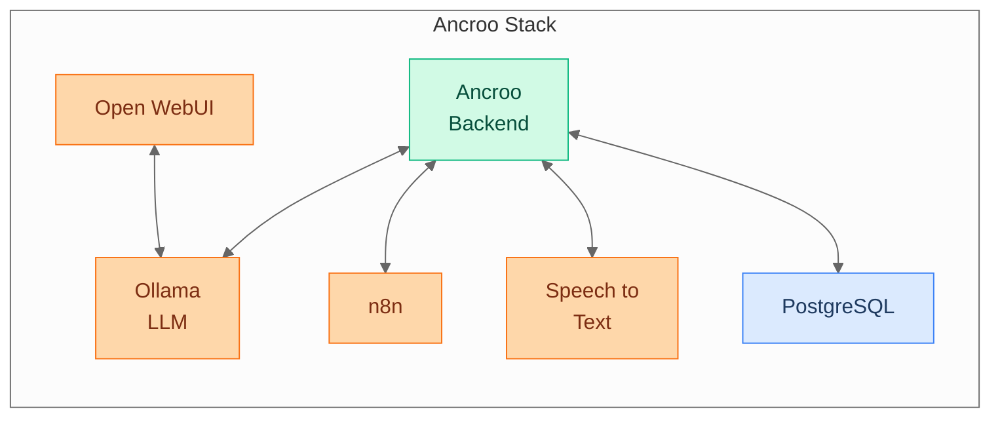

#  Ancroo Stack

[](LICENSE)
[](https://www.docker.com/)
[](https://www.gnu.org/software/bash/)
[]()

Self-hosted modular Docker stack for AI — Ollama, Open WebUI, and optional modules for workflow automation, speech-to-text, wikis, SSO, and more.

> **Early stage** — Ancroo Stack is under active development. The base installation runs on HTTP without authentication and is intended for local/trusted networks only. SSL and SSO modules exist but are experimental — do not expose to the public internet without additional security measures.

## Architecture



## Quick Start

```bash
git clone https://github.com/ancroo/ancroo-stack.git
cd ancroo-stack
bash install.sh
```

The guided installer walks you through GPU selection, STT module choice, and optional components. It also installs the Ancroo Backend and Browser Extension if their repos are present as sibling directories (cloned automatically by the [Ancroo meta-installer](https://github.com/ancroo/ancroo)).

After installation, your base stack is running:

| Service    | URL                 | Description                              |
| ---------- | ------------------- | ---------------------------------------- |
| Open WebUI | `http://<IP>:8080`  | Chat interface with RAG support          |
| Ollama API | `http://<IP>:11434` | LLM backend (Llama, Mistral, Qwen, etc.) |
| Homepage   | `http://<IP>:80`    | Service dashboard                        |
| PostgreSQL | internal            | Shared database with pgvector            |

The first Open WebUI account you create becomes admin.

## Modules

Extend the stack with `./module.sh enable <module>...`. Dependencies are resolved automatically.

```bash
# Single module
./module.sh enable bookstack

# Multiple modules at once
./module.sh enable bookstack n8n
```

| Module                                  | Description                       | Port    | Dependencies | Details                                             |
| --------------------------------------- | --------------------------------- | ------- | ------------ | --------------------------------------------------- |
| [n8n](modules/n8n/)                     | Workflow automation               | 5678    | —            | [README](modules/n8n/README.md)                     |
| [bookstack](modules/bookstack/)         | Wiki / knowledge base             | 8875    | —            | [README](modules/bookstack/README.md)               |
| [ancroo-backend](modules/ancroo-backend/) | AI workflow backend             | 8900    | n8n          | [README](modules/ancroo-backend/README.md)          |
| [speaches](modules/speaches/)           | Speech-to-Text (NVIDIA CUDA)      | 8100    | —            | [README](modules/speaches/README.md)                |
| [whisper-rocm](modules/whisper-rocm/)   | Speech-to-Text (AMD GPU)          | 8002    | —            | [README](modules/whisper-rocm/README.md)            |
| [service-tools](modules/service-tools/) | Reusable HTTP API tools           | 8500    | speaches     | [README](modules/service-tools/README.md)           |
| [adminer](modules/adminer/)             | Database management UI            | 8081    | —            | [README](modules/adminer/README.md)                 |
| [ssl](modules/ssl/)                     | HTTPS via Traefik + Let's Encrypt | 80, 443 | —            | [README](modules/ssl/README.md) ⚠️ _experimental_   |
| [sso](modules/sso/)                     | Single Sign-On (Keycloak)         | —       | ssl, valkey  | [README](modules/sso/README.md) ⚠️ _experimental_   |
| [valkey](modules/valkey/)               | In-memory cache (Valkey)          | —       | —            | [README](modules/valkey/README.md), auto-dependency |

> **Note:** Modules marked ⚠️ _experimental_ exist but are not yet fully implemented. They may be incomplete or unstable. The base installation works without them.

Infrastructure modules (set during installation):

| Module     | Description                         |
| ---------- | ----------------------------------- |
| gpu-nvidia | NVIDIA CUDA acceleration for Ollama |
| gpu-rocm   | AMD ROCm acceleration for Ollama    |

## Non-Interactive Installation

All wizard prompts can be skipped via environment variables:

```bash
ANCROO_GPU_MODE=rocm ANCROO_OLLAMA_MODEL=mistral ANCROO_NONINTERACTIVE=1 bash install.sh
```

| Variable                 | Values                     | Default            |
| ------------------------ | -------------------------- | ------------------ |
| `ANCROO_GPU_MODE`        | `nvidia`, `rocm`, `cpu`    | interactive prompt |
| `ANCROO_OLLAMA_MODEL`    | model name, `none`, empty  | interactive prompt |
| `ANCROO_STT_MODULES`     | `1`, `2`, `1,2`, `all`     | interactive prompt |
| `ANCROO_BOOKSTACK`       | `y`, `n`                   | interactive prompt |
| `ANCROO_NONINTERACTIVE`  | set to skip all prompts    | —                  |
| `ANCROO_FORCE_REINSTALL` | `1` to overwrite .env      | —                  |

## GPU Support

GPU mode is selected during installation:

```bash
bash install.sh
# Prompts for GPU mode: NVIDIA / AMD / CPU
```

| GPU    | Ollama Image                  | STT Module   |
| ------ | ----------------------------- | ------------ |
| NVIDIA | `ollama/ollama:latest` (CUDA) | speaches     |
| AMD    | `ollama/ollama:rocm`          | whisper-rocm |
| CPU    | `ollama/ollama:latest`        | —            |

## Documentation

| Document                               | Content                                                 |
| -------------------------------------- | ------------------------------------------------------- |
| [Operations Guide](docs/operations.md) | Installation, module management, updates, backups, URLs |
| [Security Guide](docs/security.md)     | Network exposure, firewall, credential management       |

Each module has its own README in `modules/<name>/README.md`.

## Requirements

- **OS:** Linux (Ubuntu 22.04+, Debian 12+)
- **Docker:** 24.0+ with Compose plugin
- **RAM:** 4 GB minimum, 8 GB+ recommended
- **Disk:** 20 GB minimum (LLM models need additional space)

Install Docker:

```bash
curl -fsSL https://get.docker.com | sh
sudo usermod -aG docker $USER
# Re-login for group permissions
```

For NVIDIA GPU support, install the [NVIDIA Container Toolkit](https://docs.nvidia.com/datacenter/cloud-native/container-toolkit/install-guide.html).

## Contributing

Contributions are welcome! Feel free to open an [issue](https://github.com/ancroo/ancroo-stack/issues) or submit a pull request.

## Security

To report a security vulnerability, please use [GitHub's private vulnerability reporting](https://github.com/ancroo/ancroo-stack/security/advisories/new) instead of opening a public issue.

## License

Apache 2.0 — see [LICENSE](LICENSE). The Ancroo name is not covered by this license and remains the property of the author.

**Important:** This license covers the ancroo-stack orchestration code (shell scripts, Docker Compose files, configuration templates). Each module's software runs in its own Docker container and is governed by its own license — see [NOTICE](NOTICE) for details.

## Author

**Stefan Schmidbauer** — [GitHub](https://github.com/Stefan-Schmidbauer)

---

Built with the help of AI ([Claude](https://claude.ai) by Anthropic).
